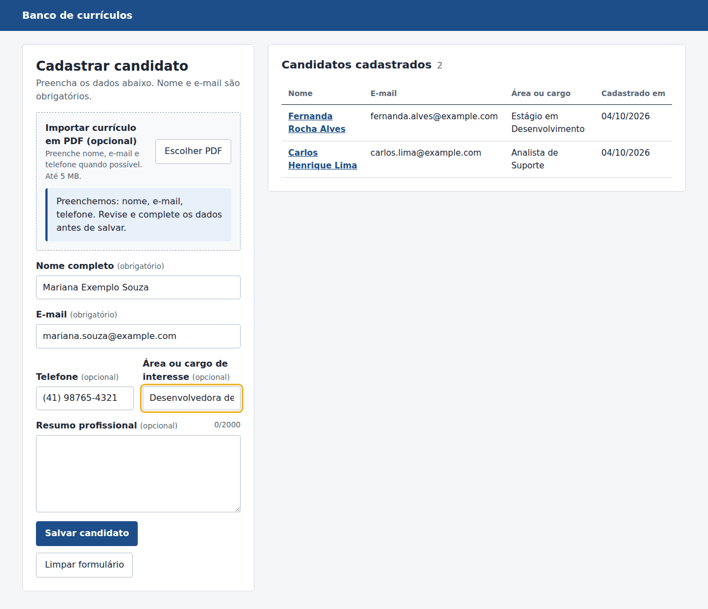
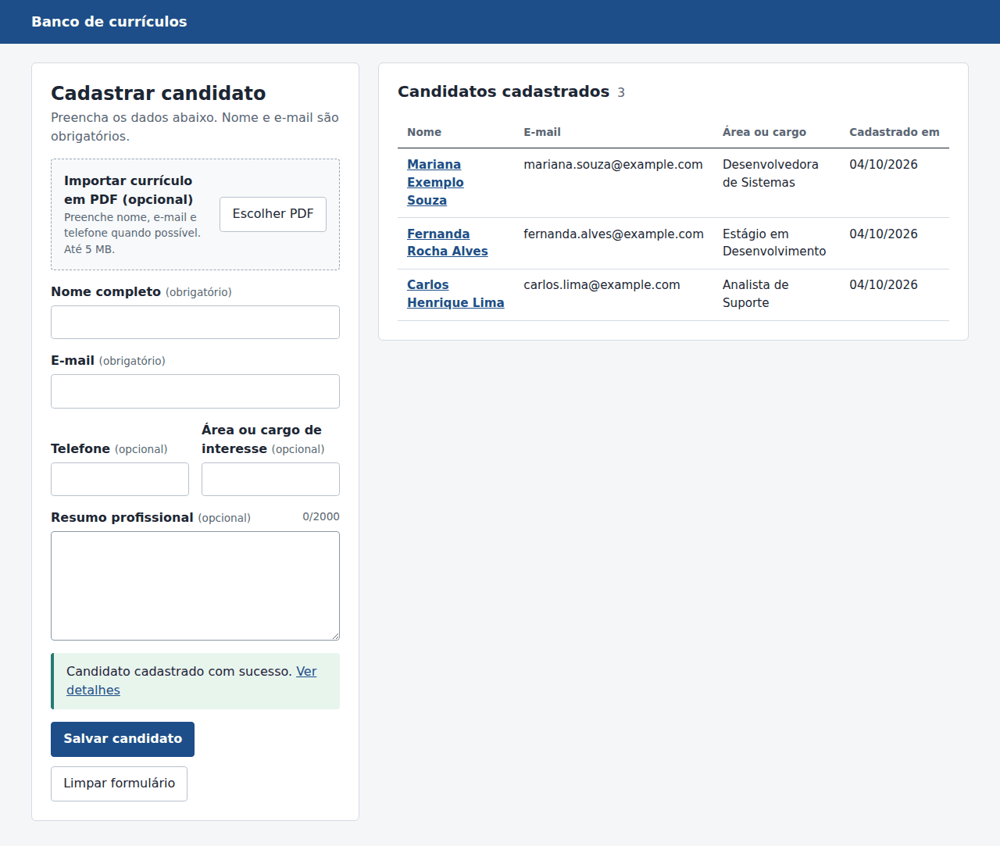
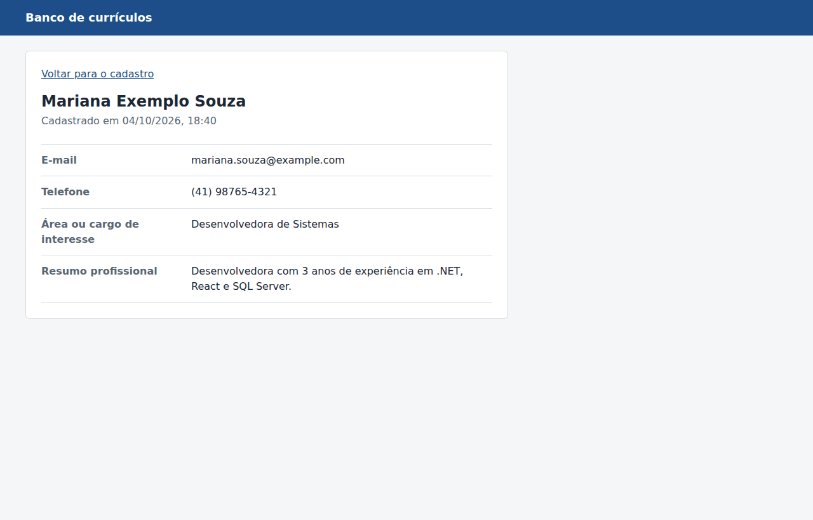

# Cadastro de currículos

Aplicação para cadastro de candidatos, desenvolvida para o desafio técnico de Desenvolvedor de Sistemas do CIEE/PR.

O cadastro pode ser feito de duas formas, sempre pelo **mesmo formulário** e com as **mesmas validações**:

- **Manual:** a pessoa preenche o formulário e salva.
- **Com PDF (opcional):** a pessoa envia um currículo em PDF, a API extrai o texto e tenta identificar nome, e-mail e telefone; os dados encontrados preenchem o formulário, que continua editável antes de salvar.

Depois de salvo, o candidato aparece na listagem e tem uma tela de detalhes. Falhas na leitura do PDF nunca impedem o cadastro manual.

## Telas

Todos os dados das imagens são fictícios.

| Importação de currículo em PDF | Cadastro e listagem | Detalhes |
|---|---|---|
|  |  |  |

## Stack e versões

| Camada | Tecnologia | Versão |
|---|---|---|
| Frontend | React + Vite (JavaScript) | React 19.3, Vite 8.3 |
| Rotas | React Router | 8.4 |
| Backend | ASP.NET Core Web API (Controllers) | .NET 10 (LTS) |
| Persistência | Entity Framework Core + provider SQL Server | 10.0.12 |
| Leitura de PDF | PdfPig (Apache 2.0) | 0.1.16 |
| Banco | SQL Server em Docker | 2022 (`mcr.microsoft.com/mssql/server:2022-latest`) |
| Testes | xUnit + WebApplicationFactory | xUnit 2.9.3 |

As versões exatas do frontend ficam travadas no `frontend/package-lock.json`.

## Arquitetura

```text
React + Vite (localhost:5173)
   │  fetch("/api/...")  → proxy do Vite
   ▼
ASP.NET Core Web API (localhost:5080)
   ├── CandidatesController ──► AppDbContext (EF Core)
   └── ResumesController
         ├── PdfFileValidator   (tamanho, extensão, assinatura %PDF-)
         ├── PdfTextExtractor   (PdfPig, todas as páginas)
         └── ResumeTextParser   (heurísticas para nome, e-mail e telefone)
                                      │
                                      ▼
                     SQL Server 2022 em Docker (localhost:14330)
```

Apenas o banco roda em container. Backend e frontend rodam diretamente na máquina, o que mantém a configuração mínima e facilita o debug.

## Pré-requisitos

- [.NET SDK 10](https://dotnet.microsoft.com/download)
- [Node.js](https://nodejs.org/) **22.22 ou superior** (recomendado: 24 LTS) — exigência do React Router 8
- [Docker](https://www.docker.com/) com Docker Compose v2

Não é necessário instalar SQL Server, `dotnet-ef` ou qualquer IDE.

## Execução rápida

Na raiz do repositório:

```bash
# 1. Banco de dados (aguarda o SQL Server ficar saudável)
docker compose up -d --wait

# 2. Backend — aplica as migrations automaticamente e sobe em http://localhost:5080
cd backend
dotnet run
```

Em outro terminal:

```bash
# 3. Frontend — sobe em http://localhost:5173
cd frontend
npm ci
npm run dev
```

Acesse **http://localhost:5173**.

Na primeira execução, o Docker baixa a imagem do SQL Server (alguns minutos, dependendo da conexão).

## Configuração

O projeto funciona sem nenhuma configuração adicional.

**O repositório não contém credenciais reais.** A credencial padrão do SQL Server é deliberadamente fictícia e exclusiva do ambiente Docker local, podendo ser sobrescrita por configuração.

| O quê | Onde | Valor padrão |
|---|---|---|
| Senha do SQL Server (container) | `docker-compose.yml` | `Curriculos_Dev_2026!` |
| Porta do SQL Server no host | `docker-compose.yml` | `14330` |
| Connection string do backend | `backend/appsettings.Development.json` | aponta para `localhost,14330` |

A porta `14330` (e não a padrão `1433`) evita conflito com um SQL Server já instalado na máquina.

### Alterando senha ou porta

1. Copie `.env.example` para `.env` e altere os valores. O Docker Compose lê o `.env` automaticamente; o arquivo está no `.gitignore`.
2. Informe ao backend a connection string correspondente pela variável de ambiente `ConnectionStrings__DefaultConnection` (o .NET não lê o `.env`):

```bash
# Linux/macOS
export ConnectionStrings__DefaultConnection="Server=localhost,14330;Database=CurriculosDb;User Id=sa;Password=SUA_SENHA;Encrypt=True;TrustServerCertificate=True"
```

```powershell
# Windows (PowerShell)
$env:ConnectionStrings__DefaultConnection = "Server=localhost,14330;Database=CurriculosDb;User Id=sa;Password=SUA_SENHA;Encrypt=True;TrustServerCertificate=True"
```

`TrustServerCertificate=True` é necessário porque o SQL Server do container usa certificado autoassinado.

## Banco de dados e migrations

O schema é definido por **migrations do EF Core** versionadas em `backend/Migrations/`, que são a única fonte da verdade do banco.

Ao iniciar, o backend cria o banco `CurriculosDb` (se não existir) e aplica as migrations pendentes. Se o SQL Server ainda estiver inicializando, a API tenta novamente por até ~30 segundos.

> Aplicar migrations na inicialização é adequado para desenvolvimento e avaliação local. Em produção, a recomendação da Microsoft é aplicá-las por script ou pipeline.

### Tabela `Candidates`

| Coluna | Tipo | Obrigatório |
|---|---|---|
| `Id` | `int` identity (PK) | sim |
| `FullName` | `nvarchar(150)` | sim |
| `Email` | `nvarchar(254)` | sim |
| `Phone` | `nvarchar(30)` | não |
| `DesiredPosition` | `nvarchar(150)` | não |
| `ProfessionalSummary` | `nvarchar(2000)` | não |
| `CreatedAt` | `datetimeoffset` (definido pelo backend, UTC) | sim |

### Criando novas migrations (apenas para quem for evoluir o schema)

```bash
dotnet tool restore
ASPNETCORE_ENVIRONMENT=Development dotnet ef migrations add NomeDaMigration --project backend
```

O `dotnet-ef` fica fixado no manifest local `dotnet-tools.json`; não é preciso instalá-lo globalmente.

## API

| Método | Rota | Descrição | Respostas |
|---|---|---|---|
| `POST` | `/api/candidates` | Cadastra um candidato | `201` criado, `400` validação |
| `GET` | `/api/candidates` | Lista candidatos (mais recentes primeiro) | `200` |
| `GET` | `/api/candidates/{id}` | Detalhes de um candidato | `200`, `404` |
| `POST` | `/api/resumes/parse` | Lê um PDF (`multipart/form-data`, campo `file`) e devolve `{ fullName, email, phone }`. **Não grava nada.** | `200`, `400`, `413`, `422` |

Erros seguem o padrão **ProblemDetails** (RFC 9457). Erros de validação trazem as mensagens por campo em `errors`.

O arquivo `backend/Curriculos.Api.http` tem exemplos prontos de chamadas (VS Code com REST Client, Visual Studio ou Rider).

## Validações

O **backend é a fonte da verdade**; o frontend repete as mesmas regras apenas para dar retorno imediato.

- Nome completo e e-mail são obrigatórios (espaços em branco não contam).
- E-mail no formato `nome@dominio.tld` — a mesma expressão é usada no backend e no frontend.
- Limites de tamanho: nome 150, e-mail 254, telefone 30, área/cargo 150, resumo 2000 caracteres.
- Campos opcionais vazios são gravados como `NULL`; todos os valores passam por *trim*.

## Importação de currículo (PDF)

### Como funciona

1. A pessoa escolhe um PDF no topo do formulário (até 5 MB).
2. O backend valida o arquivo: presença, tamanho, extensão `.pdf` e assinatura `%PDF-` no conteúdo. O `Content-Type` enviado pelo navegador não é usado para decidir, pois é controlado pelo cliente.
3. O texto de todas as páginas é extraído com o PdfPig (`ContentOrderTextExtractor`, que respeita a ordem de leitura melhor que o texto bruto da página).
4. O parser procura os dados com regras simples e determinísticas, sem IA, OCR ou serviços externos:
   - **E-mail:** primeira ocorrência no formato `nome@dominio.tld`, devolvida como encontrada.
   - **Telefone:** formatos brasileiros (`(41) 98765-4321`, `41 98765-4321`, `+55 41 98765-4321`, `+5541987654321`, fixos com 8 dígitos). Uma sequência só de dígitos, como `41987654321`, só é aceita se a linha tiver um rótulo como "Telefone" ou "Celular", para não confundir com CPF. O resultado é normalizado para `(DD) NNNNN-NNNN`.
   - **Nome:** primeira linha, entre as 8 primeiras, que pareça um nome: só letras, de 2 a 6 palavras, cada uma iniciada por maiúscula (exceto partículas como "da" e "dos"), sem palavras de título de seção ou de cargo ("Currículo", "Experiência", "Desenvolvedora"…). O nome é devolvido como encontrado, sem alterar maiúsculas.
5. Campos não identificados voltam `null`. O formulário recebe só os campos encontrados e **apenas onde estiver vazio**, para nunca apagar o que a pessoa já digitou.

### Respostas

| Situação | HTTP | Mensagem |
|---|---|---|
| Dados extraídos (mesmo que parcialmente) | `200` | Formulário preenchido com o que foi encontrado |
| Nenhum dado encontrado | `200` (campos `null`) | "Nenhum dado identificado no PDF. Preencha o formulário manualmente." |
| Arquivo ausente | `400` | "Selecione um arquivo PDF." |
| Não é PDF (extensão ou conteúdo) | `400` | "O arquivo enviado não é um PDF válido." |
| Maior que 5 MB | `413` | "O PDF deve possuir no máximo 5 MB." |
| PDF corrompido, protegido por senha ou sem texto (escaneado) | `422` | "Não foi possível extrair informações do currículo. Você pode preencher o formulário manualmente." |

O limite da requisição no endpoint é de 6 MB, um pouco acima do limite funcional de 5 MB, para que arquivos levemente maiores recebam a mensagem clara da aplicação. O frontend também verifica extensão e tamanho antes de enviar.

### Testando com os arquivos de exemplo

A pasta `samples/` tem arquivos fictícios (detalhes em `samples/README.md`):

- `curriculo-ficticio.pdf` — preenche nome, e-mail e telefone.
- `curriculo-escaneado.pdf` — PDF só com imagem; mostra o aviso e mantém o formulário disponível.
- `nao-e-um-pdf.pdf` — texto renomeado; é rejeitado.

### Limitações do parser

A extração é heurística e não funciona perfeitamente para qualquer currículo. Quando um dado não é detectado, o campo fica vazio e editável.

- **Sem OCR:** PDFs escaneados ou exportados como imagem não têm texto para extrair.
- **Layouts em colunas** ou com caixas de texto podem mudar a ordem do texto extraído e afetar a detecção do nome.
- **Nome:** pode não ser encontrado se estiver numa imagem, em fonte decorativa, numa única palavra, em minúsculas ou depois das 8 primeiras linhas; um título fora da lista de exclusão pode ser confundido com nome.
- **Telefone:** números estrangeiros e formatos incomuns não são reconhecidos; sequências só de dígitos sem rótulo são ignoradas de propósito.
- **E-mail:** pode falhar se a extração inserir espaços dentro do endereço.
- Área/cargo e resumo profissional não são extraídos.
- PDFs protegidos por senha de abertura não são lidos.

## Testes

Na raiz do repositório:

```bash
dotnet test
```

Os testes não precisam de SQL Server nem Docker, e rodam também no GitHub Actions (`.github/workflows/ci.yml`), junto com o build do frontend, a cada push:

- `CandidateValidationTests` — obrigatoriedade, formato de e-mail, tamanhos e trim antes da validação.
- `PdfFileValidatorTests` — arquivo ausente, limite de 5 MB, extensão e assinatura `%PDF-`.
- `ResumeTextParserTests` — e-mail, formatos de telefone, números que não são telefone (CPF, CEP, datas), heurística de nome e campos ausentes.
- `PdfTextExtractorTests` — extração do currículo fictício, PDF escaneado sem texto e PDF corrompido.
- `CandidatesApiTests` e `ResumesApiTests` — sobem a API real em memória (WebApplicationFactory) e verificam o contrato HTTP: cadastro, listagem, detalhes, `400`, `404`, e-mail duplicado e importação com `200`, `400`, `413` e `422`. Nesses testes o banco é substituído pelo provider InMemory do EF Core; a persistência em SQL Server é validada na execução local.

## Decisões de escopo

- **E-mail duplicado é permitido.** O enunciado não define unicidade, então nenhuma regra foi inventada.
- **Sem edição ou exclusão**, pois não foram solicitadas.
- **Sem autenticação**, fora do escopo do desafio.

## Solução de problemas

| Sintoma | Causa provável | Solução |
|---|---|---|
| `docker compose up` falha por porta em uso | Outro serviço na porta 14330 | Defina `MSSQL_HOST_PORT` no `.env` e ajuste a connection string |
| `unknown flag: --wait` | Docker Compose antigo | Rode `docker compose up -d`, aguarde ~30 s e siga normalmente |
| Backend registra "SQL Server indisponível" | Banco ainda iniciando | Aguarde: a API tenta novamente sozinha |
| Backend falha com erro de login | Senha alterada no `.env` mas não no backend | Configure `ConnectionStrings__DefaultConnection` (ver Configuração) |
| Lista mostra "Não foi possível conectar ao servidor" | Backend não está rodando | Inicie o backend (`dotnet run` em `backend/`) |
| `npm ci` reclama da versão do Node | Node abaixo de 22.22 | Atualize para Node 24 LTS |
| Mac com Apple Silicon | Imagem do SQL Server é amd64 | Habilite a emulação Rosetta no Docker Desktop |
| Recomeçar com banco limpo | — | `docker compose down -v` e `docker compose up -d --wait` |

## Desenvolvimento

Planejamento, decisões técnicas, alternativas descartadas, uso de IA, dificuldades e limitações estão em [`DESENVOLVIMENTO.md`](DESENVOLVIMENTO.md).
